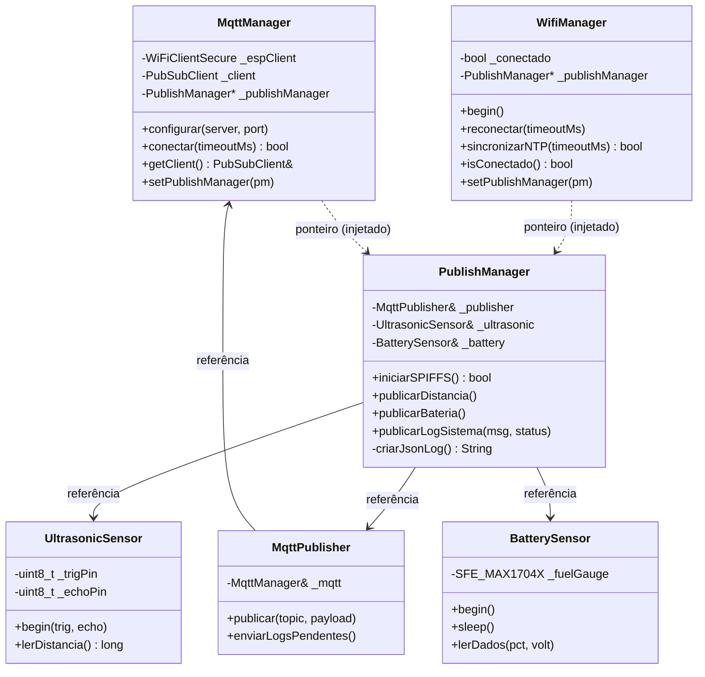

# 🌊 Projeto de Monitoramento de Lâmina d’Água com ESP32

Este repositório contém o firmware de um sistema embarcado para o monitoramento em tempo real do nível de uma lâmina d’água, desenvolvido como parte de um projeto de Iniciação Científica no SENAI CIMATEC.

---

## 🎯 Sobre o Projeto

O objetivo principal é desenvolver uma solução IoT de baixo custo para medir o nível da água utilizando um sensor ultrassônico e transmitir esses dados para a nuvem. O sistema se conecta a uma rede Wi-Fi, envia os dados formatados em JSON para o AWS IoT Core e inclui funcionalidades de resiliência, como armazenamento local de dados em caso de falha de conexão.

O firmware é estruturado com **orientação a objetos em C++**, onde cada módulo é encapsulado em uma classe com estado privado e interface pública. As dependências entre os módulos são resolvidas por **injeção de dependência** via referências no construtor, promovendo baixo acoplamento e alta coesão.

---

## ✨ Funcionalidades Principais

-   **Medição de Nível:** Leitura da distância da lâmina d'água com sensor ultrassônico (classe `UltrasonicSensor`).
-   **Monitoramento de Bateria:** Leitura de voltagem e porcentagem de carga via fuel gauge MAX1704x (classe `BatterySensor`).
-   **Conectividade:** Conexão a redes Wi-Fi com portal captivo e reconexão automática (classe `WifiManager`).
-   **Comunicação MQTT:** Envio de dados para o AWS IoT Core usando protocolo seguro TLS/SSL (classe `MqttManager`).
-   **Publicação com Fallback:** Publicação MQTT com armazenamento local em SPIFFS quando offline (classe `MqttPublisher`).
-   **Orquestração:** Coordenação de sensores, logging e publicação centralizada (classe `PublishManager`).
-   **Sincronização de Tempo:** Obtenção de timestamp via NTP para registros precisos.
-   **Formato de Dados:** Empacotamento das informações em formato JSON para fácil integração.
-   **Deep Sleep:** Modo de economia de energia com ciclos de 30 minutos, preservando contadores entre despertares via memória RTC.

---

## 🛠️ Tecnologias Utilizadas

-   **Linguagem:** C/C++ (Arduino Framework)
-   **Microcontrolador:** ESP32
-   **Protocolo de Comunicação:** MQTT (com TLS)
-   **Sistema de Arquivos:** SPIFFS
-   **Sincronização de Tempo:** NTP

---

## 🔩 Hardware Necessário

-   Placa de desenvolvimento baseada no **ESP32**.
-   **Sensor Ultrassônico HC-SR04** (ou similar).
-   **Fuel Gauge MAX1704x** para monitoramento de bateria.
-   Cabos e protoboard para as conexões.

---

## 🚀 Começando

Siga os passos abaixo para compilar e executar o projeto.

### Pré-requisitos

-   **[Visual Studio Code](https://code.visualstudio.com/)**
-   **[Extensão PlatformIO IDE](https://platformio.org/platformio-ide)** instalada no VS Code.

### Instalação e Configuração

1.  **Clone o repositório:**
    ```bash
    git clone https://github.com/ICWaterControl/microcontroller-code.git
    cd microcontroller-code
    ```

2.  **Abra o projeto no VS Code:**
    -   Com o VS Code aberto, clique em `File > Open Folder...` e selecione a pasta do projeto.
    -   O PlatformIO irá reconhecer o `platformio.ini` e instalar as dependências automaticamente.

3.  **Configure as credenciais do AWS IoT Core:**
    -   Abra o arquivo `include/aws_iot_config.h`.
    -   Localize e altere os seguintes campos com os valores do seu ambiente:

    ```cpp
    static const char AWS_IOT_ENDPOINT[] = "SEU_ENDPOINT_DO_AWS_IOT_CORE";
    static const char AWS_IOT_CLIENT_ID[] = "SEU_CLIENT_ID";
    static const char AWS_IOT_ROOT_CA[] PROGMEM = R"EOF(... )EOF";
    static const char AWS_IOT_DEVICE_CERT[] PROGMEM = R"EOF(... )EOF";
    static const char AWS_IOT_PRIVATE_KEY[] PROGMEM = R"EOF(... )EOF";
    ```

    -   O firmware usa a porta `8883` por padrão para MQTT com TLS.

4.  **Compile e envie para o ESP32:**
    -   Conecte o ESP32 ao seu computador.
    -   Na barra de status do PlatformIO (canto inferior do VS Code), clique no ícone de seta (→) para compilar e fazer o upload do firmware.

5.  **Configure a rede Wi-Fi:**
    -   Após o primeiro boot, o ESP32 criará um ponto de acesso (AP) com o nome **`CaixaDagua_AP`**.
    -   Conecte-se a esta rede Wi-Fi com seu celular ou computador.
    -   Abra um navegador e acesse o endereço **`192.168.4.1`**.
    -   Uma página de configuração será exibida. Selecione a sua rede Wi-Fi, insira a senha e salve.
    -   O ESP32 irá se conectar à sua rede e reiniciar.

6.  **Monitore a execução:**
    -   Após o upload, clique no ícone de tomada (🔌) para abrir o Monitor Serial e acompanhar as mensagens de log do dispositivo.

---

## 📂 Estrutura do Repositório

```
.
├── include/                # Cabeçalhos das classes (.h)
│   ├── aws_iot_config.h    # Certificados e endpoint do AWS IoT Core
│   ├── battery_sensor.h    # Classe BatterySensor
│   ├── main.h              # Inclusões agregadas para main.cpp
│   ├── mqtt_manager.h      # Classe MqttManager
│   ├── mqtt_publisher.h    # Classe MqttPublisher
│   ├── publish_manager.h   # Classe PublishManager
│   ├── ultrasonic_sensor.h # Classe UltrasonicSensor
│   └── wifi_manager.h      # Classe WifiManager
├── lib/                    # Bibliotecas locais (se houver)
├── src/                    # Implementação das classes (.cpp)
│   ├── main.cpp            # Ponto de entrada: instanciação e orquestração
│   ├── battery_sensor.cpp  # Implementação de BatterySensor
│   ├── mqtt_manager.cpp    # Implementação de MqttManager
│   ├── mqtt_publisher.cpp  # Implementação de MqttPublisher
│   ├── publish_manager.cpp # Implementação de PublishManager
│   ├── ultrasonic_sensor.cpp # Implementação de UltrasonicSensor
│   └── wifi_manager.cpp    # Implementação de WifiManager
├── test/                   # Testes (se houver)
├── .gitignore
├── diagram.json
├── platformio.ini          # Arquivo de configuração do PlatformIO
├── README.md
└── wokwi.toml
```

---

## 🏗️ Arquitetura OOP

O firmware é organizado em **6 classes** com responsabilidades bem definidas, conectadas por injeção de dependência:



### Descrição dos Módulos

| Classe | Responsabilidade |
| :--- | :--- |
| **`UltrasonicSensor`** | Driver do sensor HC-SR04. Encapsula pinos e constantes de temporização. Realiza 5 leituras com média. |
| **`BatterySensor`** | Driver do fuel gauge MAX1704x. Gerencia I2C, leitura de SOC/voltagem e modo sleep. |
| **`MqttManager`** | Gerencia a conexão TLS com o AWS IoT Core. Encapsula `WiFiClientSecure` e `PubSubClient`. |
| **`MqttPublisher`** | Publica mensagens MQTT com fallback automático para SPIFFS. Gerencia reenvio de logs pendentes. |
| **`PublishManager`** | Orquestra sensores e publicação. Cria payloads JSON com timestamp e coordena todas as publicações. |
| **`WifiManager`** | Gerencia conexão Wi-Fi via portal captivo, reconexão automática e sincronização NTP. |

### Dependência Circular

`WifiManager` e `MqttManager` precisam do `PublishManager` para registrar logs, mas `PublishManager` depende de `MqttPublisher` → `MqttManager`. A solução é **injeção tardia via ponteiro**: ambos recebem `PublishManager*` através de `setPublishManager()`, chamado no início do `setup()` após a construção de todos os objetos.

### Fluxo de Inicialização (Deep Sleep)

O ESP32 opera em ciclos de **deep sleep de 30 minutos**. A cada despertar, o `setup()` executa a sequência completa:

```
1. setCpuFrequencyMhz(80)          → Reduz consumo
2. publishManager.iniciarSPIFFS()  → Monta sistema de arquivos
3. wifiManager.begin()             → Conecta via portal captivo
4. wifiManager.reconectar()        → Tenta reconexão se necessário
5. btStop()                        → Desativa Bluetooth
6. wifiManager.sincronizarNTP()    → Sincroniza relógio (a cada 12 ciclos)
7. mqttManager.configurar()        → Configura TLS + broker
8. mqttManager.conectar()          → Conecta ao AWS IoT Core
9. mqttPublisher.enviarLogsPendentes() → Reenvia logs offline
10. publishManager.publicarDistancia() → Lê e publica distância
11. publishManager.publicarBateria()   → Lê e publica bateria
12. batterySensor.sleep()          → Desliga fuel gauge
13. esp_deep_sleep_start()         → Entra em deep sleep (30 min)
```

---

## 📡 Comunicação MQTT

-   **Broker:** AWS IoT Core (configurável)
-   **Protocolo:** MQTT com TLS/SSL
-   **Formato da Mensagem:** JSON

**Exemplo de payload:**
```json
{
    "timestamp": "2026-04-24 10:30:00",
    "status": "SUCCESS",
    "origem": "esp32",
    "mensagem": "Distancia lida: 123",
    "distancia": 123
}
```

---

## 📡 Tópicos MQTT

O sistema utiliza os seguintes tópicos para comunicação:

-   `sdk/test/java`: Publicação das medições de distância.
-   `sdk/test/python`: Publicação das medições de bateria.
-   `sdk/test/js`: Publicação de logs de sistema.

Mensagens não publicadas são armazenadas localmente em SPIFFS (`/log.txt`) e reenviadas no próximo ciclo com conectividade.

---

## 👥 Equipe

| Função | Nome | LinkedIn |
| :--- | :--- | :--- |
| **Orientador** | Dr. Márcio Sousa | [LinkedIn](https://www.linkedin.com/in/marcio-soussa/) |
| **Desenvolvedor** | Pedro Henrique Mascarenhas de Andrade | [LinkedIn](https://www.linkedin.com/in/pedrohmandrade/) |
| **Desenvolvedor** | Gustavo Maia | [LinkedIn](https://www.linkedin.com/in/gustavomaiajesus/) |

